# Crypto Casino

The project is about a casino whose backend is based on smart contracts deployed on the Binance Smart Chain. You can buy tokens, play roulette and withdraw tokens

## Features

* You start with no conection to a wallet  
    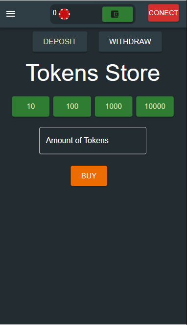  

* You can connect to the nav wallet for example metamask  
    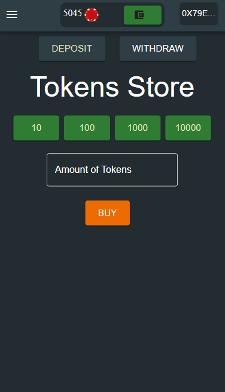  

* You can buy tokens  
    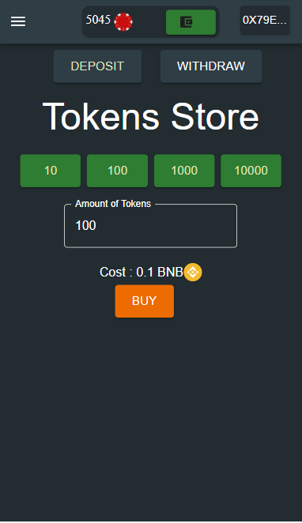  

* You get notified with the result of the purchase  
      

* The ammount of tokens is updated  
    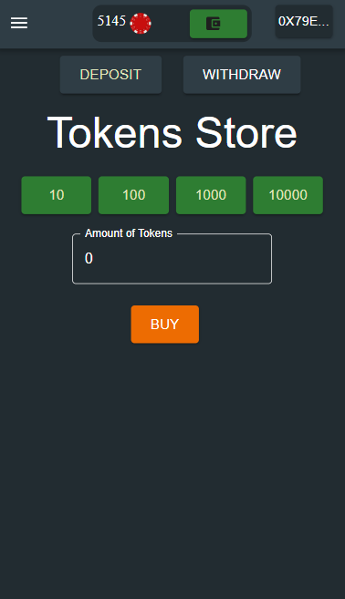  

* You can withdraw tokens  
    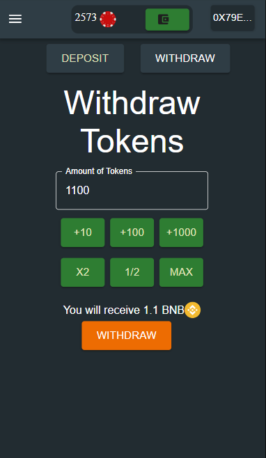  

* You can choose options in a drawer  
    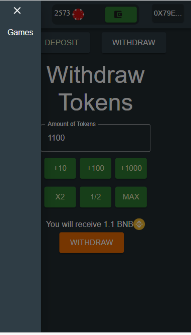  

* You can select the game where you want to bet the tokens  
    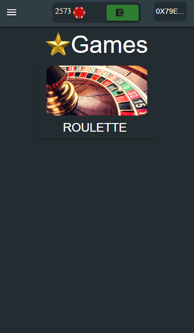  

* There is a roulette with its options to bet  
    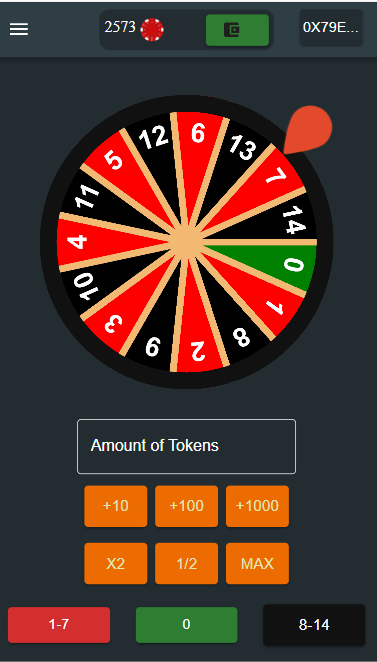  

* You can play roulette and you get notified with the result of the bet  
    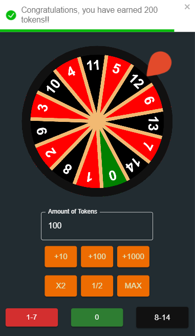  

* You cant bet or withdraw more tokens than your balance  
    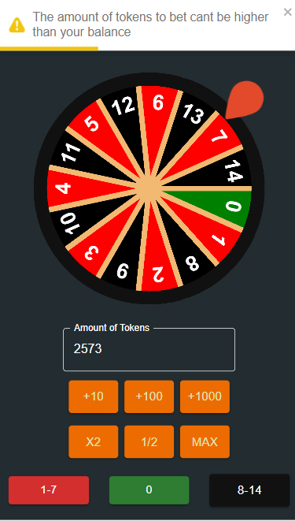  

* There is also a desktop version that have the same features
    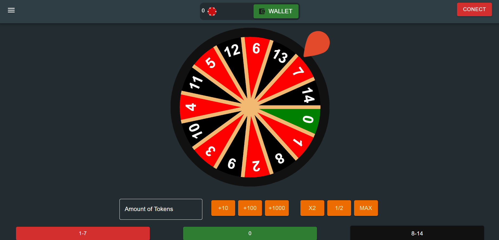
